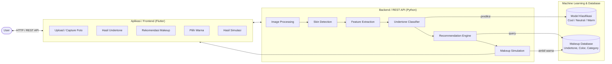
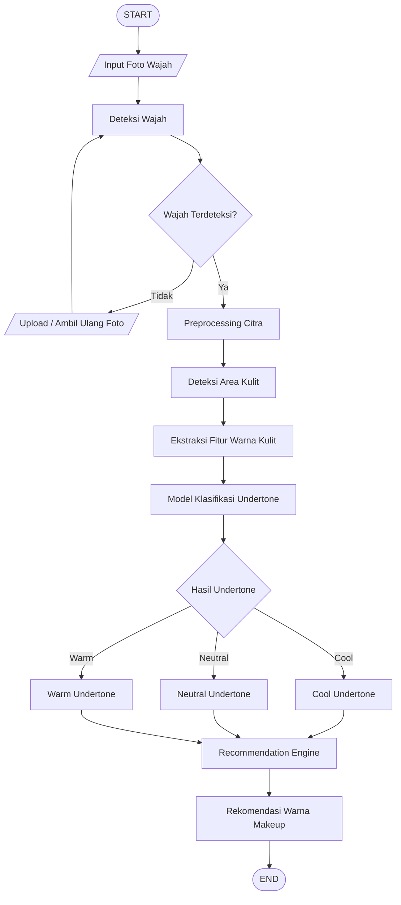
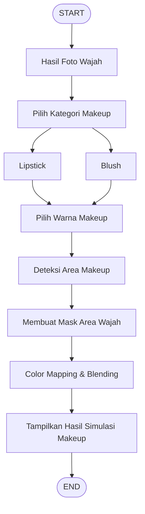
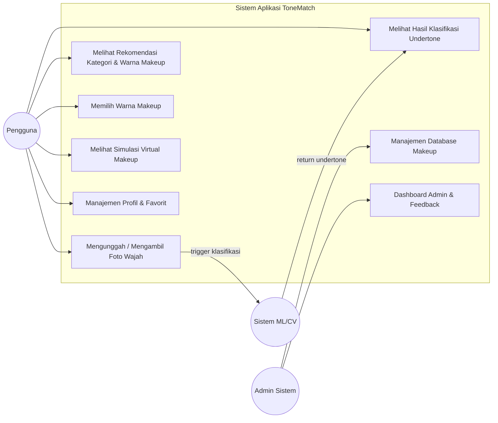
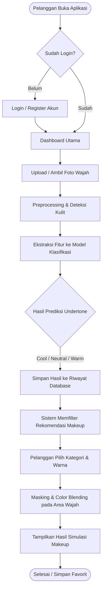
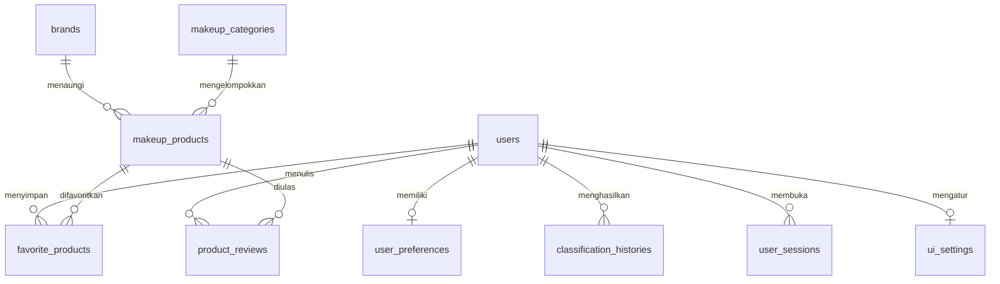

# ToneMatch

**Aplikasi Klasifikasi Undertone Kulit dan Rekomendasi Makeup Berbasis Computer Vision**

Proyek Mata Kuliah Telematika — Departemen Teknik Komputer, Fakultas Teknologi Elektro dan Informatika Cerdas, Institut Teknologi Sepuluh Nopember.

| | |
|---|---|
| **Status** | Dalam pengembangan (September – Desember) |
| **Durasi** | ± 4 bulan |
| **Platform** | Mobile (Flutter) + REST API (Python) + Firebase |
| **Output** | Klasifikasi undertone `Cool` / `Neutral` / `Warm`, rekomendasi warna makeup, simulasi makeup virtual |

### Tim Pengembang

| Nama | NRP | Peran |
|---|---|---|
| Yudhi Nendra Kurniawan | 5024231012 | Image Processing & Machine Learning |
| Alvito Aryo Putra | 5024231077 | Backend, Recommendation System, Frontend |

### Dosen Pengampu

- Ahmad Zaini, S.T., M.T.
- Dr. Arief Kurniawan, S.T., M.T.
- Arta Kusuma Hernanda, S.T., M.T.

---

## Daftar Isi

1. [Latar Belakang](#1-latar-belakang)
2. [Solusi yang Ditawarkan](#2-solusi-yang-ditawarkan)
3. [Ruang Lingkup & Prioritas Fitur](#3-ruang-lingkup--prioritas-fitur)
4. [Arsitektur Sistem](#4-arsitektur-sistem)
5. [Alur Kerja Sistem](#5-alur-kerja-sistem)
6. [Diagram](#6-diagram)
7. [Pipeline Machine Learning](#7-pipeline-machine-learning)
8. [Recommendation Engine](#8-recommendation-engine)
9. [Modul Simulasi Makeup](#9-modul-simulasi-makeup)
10. [Skema Database (Firestore)](#10-skema-database-firestore)
11. [Spesifikasi API](#11-spesifikasi-api)
12. [Tech Stack & Struktur Repository](#12-tech-stack--struktur-repository)
13. [Panduan Setup](#13-panduan-setup)
14. [Timeline Pengerjaan](#14-timeline-pengerjaan)
15. [Pembagian Tugas](#15-pembagian-tugas)
16. [Dataset](#16-dataset)
17. [Pengujian & Metrik Keberhasilan](#17-pengujian--metrik-keberhasilan)
18. [Kendala, Risiko & Keamanan](#18-kendala-risiko--keamanan)
19. [Referensi](#19-referensi)

---

## 1. Latar Belakang

Undertone adalah warna dasar yang berada di bawah permukaan kulit dan tidak berubah meskipun warna permukaan kulit berubah karena paparan matahari. Undertone umumnya dikelompokkan menjadi tiga kategori: **Cool**, **Neutral**, dan **Warm**. Penentuan undertone yang tepat menjadi dasar dalam pemilihan warna produk kosmetik.

Permasalahan yang melatarbelakangi proyek ini:

1. **Penentuan undertone masih manual dan subjektif.** Metode populer seperti mengamati warna pembuluh darah di pergelangan tangan atau mencocokkan warna perhiasan (emas vs perak) bergantung pada persepsi masing-masing orang, sehingga hasilnya dapat berbeda-beda untuk orang yang sama.
2. **Kesalahan penentuan undertone berdampak pada pemilihan makeup.** Warna foundation, lipstik, blush, dan eyeshadow yang tidak sesuai karakteristik undertone menghasilkan tampilan yang kurang optimal dan berpotensi menimbulkan pemborosan pembelian produk.
3. **Tidak ada gambaran hasil sebelum membeli.** Pengguna umumnya harus mencoba produk secara langsung di toko untuk mengetahui kecocokan warna, yang kurang praktis terutama untuk pembelian daring.
4. **Faktor lingkungan memengaruhi hasil analisis.** Kondisi pencahayaan dan kualitas kamera membuat warna kulit pada foto bergeser dari warna aslinya, sehingga dibutuhkan tahap pengolahan citra sebelum warna kulit dianalisis.

## 2. Solusi yang Ditawarkan

ToneMatch menyatukan tiga proses yang biasanya terpisah — menentukan undertone, memilih warna makeup, dan mencoba warna makeup — ke dalam satu aplikasi.

| No | Solusi | Penanganan Masalah |
|---|---|---|
| 1 | Klasifikasi undertone otomatis berbasis computer vision dengan keluaran `Cool` / `Neutral` / `Warm` beserta confidence score | Masalah 1 |
| 2 | Recommendation engine yang memetakan hasil undertone ke katalog warna makeup (foundation, lipstick, blush, eyeshadow) | Masalah 2 |
| 3 | Simulasi makeup virtual dengan color mapping & blending pada area bibir dan pipi | Masalah 3 |
| 4 | Pipeline preprocessing citra (koreksi warna, reduksi noise, normalisasi pencahayaan) sebelum ekstraksi fitur | Masalah 4 |

## 3. Ruang Lingkup & Prioritas Fitur

Untuk tim dua orang dengan durasi ± 4 bulan, fitur dibagi menjadi tiga tingkat prioritas. **MVP wajib selesai**; Tahap 2 dikerjakan bila MVP stabil; Tahap 3 bersifat opsional dan boleh dicatat sebagai *future work* pada laporan akhir.

### MVP (Prioritas Wajib)

- [ ] Upload / capture foto wajah
- [ ] Face detection & skin region detection
- [ ] Image preprocessing (color correction, noise reduction)
- [ ] Ekstraksi fitur warna kulit
- [ ] Model klasifikasi undertone (Cool / Neutral / Warm) + confidence score
- [ ] Database katalog makeup
- [ ] Recommendation engine berbasis rule/mapping undertone → warna
- [ ] Simulasi makeup virtual untuk lipstick & blush
- [ ] Autentikasi pengguna (login/register)
- [ ] Riwayat klasifikasi

### Tahap 2 (Prioritas Menengah)

- [ ] Manajemen profil & preferensi pengguna (skin type, sensitivitas kulit, brand favorit)
- [ ] Favorit / wishlist produk
- [ ] Admin dashboard: CRUD katalog makeup, brand, dan kategori
- [ ] Rate limiting pada endpoint ML
- [ ] Auto-delete gambar wajah setelah sesi berakhir

### Tahap 3 (Opsional / Future Work)

- [ ] Ulasan & rating produk oleh pengguna
- [ ] Admin dashboard: manajemen user, feedback, dan komplain
- [ ] UI/UX customization (light/dark mode, layout preference)
- [ ] Simulasi eyeshadow dan foundation
- [ ] Rekomendasi berbasis machine learning (bukan rule-based)

> **Catatan perencanaan:** dokumen workflow awal mencantumkan cakupan yang jauh lebih luas daripada proposal (admin dashboard penuh, review produk, session management, kustomisasi UI). Pemisahan prioritas di atas dibuat agar cakupan tetap realistis terhadap timeline dan jumlah anggota tim.

---

## 4. Arsitektur Sistem

ToneMatch terdiri dari empat komponen utama: aplikasi pengguna (frontend), backend server, model klasifikasi machine learning, dan database makeup.



**Alur data ringkas:**

1. Pengguna mengambil atau mengunggah foto wajah melalui aplikasi.
2. Foto dikirim ke backend melalui REST API.
3. Backend menjalankan preprocessing, deteksi area kulit, dan ekstraksi fitur warna.
4. Fitur diklasifikasikan oleh model machine learning menjadi `Cool`, `Neutral`, atau `Warm`.
5. Hasil klasifikasi digunakan recommendation engine untuk mengambil warna makeup yang sesuai dari database.
6. Warna yang dipilih pengguna diproses modul makeup simulation.
7. Hasil simulasi dikembalikan dan ditampilkan pada aplikasi.

### Pembagian Tanggung Jawab Komponen

| Komponen | Teknologi | Tanggung Jawab |
|---|---|---|
| Frontend | Flutter | UI/UX, kamera & file picker, menampilkan hasil dan simulasi |
| Backend API | Python (FastAPI / Flask) | Orkestrasi pipeline, validasi input, autentikasi, rate limiting |
| CV & ML | OpenCV, MediaPipe, scikit-learn / TensorFlow | Deteksi wajah & kulit, preprocessing, klasifikasi undertone |
| Database & Storage | Firebase Firestore + Firebase Storage | Katalog makeup, data user, riwayat, penyimpanan gambar |

---

## 5. Alur Kerja Sistem

1. Pengguna membuka aplikasi dan mengambil atau mengunggah foto wajah.
2. Sistem melakukan **face detection** untuk memastikan terdapat wajah pada gambar.
3. Sistem melakukan **skin region detection** untuk memperoleh area kulit yang dianalisis.
4. Area kulit melalui **image preprocessing** untuk mengurangi pengaruh noise dan kondisi pencahayaan.
5. Sistem mengekstraksi **karakteristik warna kulit** menggunakan color space tertentu.
6. Data hasil ekstraksi diproses **model klasifikasi** untuk menentukan undertone `Cool` / `Neutral` / `Warm`.
7. Hasil klasifikasi ditampilkan beserta **tingkat keyakinan (confidence score)**.
8. Sistem mengambil data rekomendasi makeup dari database berdasarkan undertone.
9. Pengguna memilih kategori makeup dan warna yang direkomendasikan.
10. Bila fitur simulasi dipilih, sistem mendeteksi **area makeup** yang sesuai (bibir atau pipi).
11. Sistem menerapkan warna pilihan pada area tersebut melalui **color blending**.
12. Hasil simulasi ditampilkan sehingga pengguna dapat membandingkan beberapa pilihan warna.

---

## 6. Diagram

### 6.1 Flowchart Klasifikasi dan Rekomendasi



### 6.2 Flowchart Simulasi Makeup



### 6.3 Use Case Diagram



### 6.4 Activity Diagram



---

## 7. Pipeline Machine Learning

### 7.1 Tahapan Pipeline

```
Foto Wajah
  → Face Detection (MediaPipe Face Mesh / Haar Cascade)
  → Landmark Extraction (titik pipi, dahi, rahang)
  → Skin Region Masking (patch ROI pada area kulit bersih)
  → Preprocessing (white balance, gamma correction, denoising, normalisasi)
  → Color Space Conversion (RGB → Lab, HSV, YCbCr)
  → Feature Extraction (statistik warna per channel)
  → Classifier
  → Label (Cool / Neutral / Warm) + Confidence Score
```

### 7.2 Preprocessing

| Tahap | Tujuan | Catatan Implementasi |
|---|---|---|
| Resize & normalisasi | Menyamakan dimensi input | Resize sisi terpanjang ke 512 px |
| Gray World / White Patch | Koreksi color cast akibat pencahayaan | Wajib, karena warna kulit sangat sensitif terhadap lighting |
| Gamma correction | Menyeimbangkan gambar terlalu terang/gelap | Adaptif berdasarkan mean luminance |
| Bilateral filter | Mengurangi noise tanpa menghilangkan tepi | Menjaga tekstur kulit |
| Specular removal | Menghilangkan kilau/highlight pada kulit | Opsional, threshold pada channel V |

### 7.3 Ekstraksi Fitur

Fitur diambil dari beberapa ROI kulit (pipi kiri, pipi kanan, dahi) lalu dirata-ratakan.

| Color Space | Fitur | Alasan |
|---|---|---|
| CIELab | mean & std `L*`, `a*`, `b*` | `b*` (biru↔kuning) dan `a*` (hijau↔merah) sangat diskriminatif untuk warm vs cool |
| HSV | mean & std `H`, `S`, `V` | Hue memisahkan dominasi kuning/merah muda |
| YCbCr | mean `Cb`, `Cr` | Standar pada skin detection |
| Turunan | rasio `a*/b*`, ITA (Individual Typology Angle) | ITA merepresentasikan tingkat kecerahan kulit secara terstandar |

**Formula ITA:** `ITA = arctan((L* - 50) / b*) × (180 / π)`

### 7.4 Model Klasifikasi

Dikerjakan dua jalur untuk perbandingan pada laporan akhir:

| Pendekatan | Model | Input | Kelebihan |
|---|---|---|---|
| Baseline | SVM (RBF), Random Forest, XGBoost | Vektor fitur warna hasil ekstraksi | Cepat, ringan, mudah dijelaskan, cocok untuk dataset kecil |
| Alternatif | CNN (MobileNetV3 / EfficientNet-B0, transfer learning) | Patch kulit hasil crop | Menangkap pola yang tidak terwakili fitur manual |

**Strategi training:**

- Split data 70% train / 15% validation / 15% test dengan stratifikasi per kelas.
- Augmentasi terbatas pada brightness, contrast, dan noise. **Hindari augmentasi hue/saturation** karena akan merusak label undertone.
- Penanganan kelas tidak seimbang menggunakan class weight atau SMOTE.
- Simpan model terbaik dalam format `.pkl` (scikit-learn) atau `.tflite` (CNN, untuk kemungkinan inferensi on-device).

### 7.5 Confidence Score

Probabilitas keluaran model (`predict_proba` atau softmax) ditampilkan sebagai persentase. Bila probabilitas tertinggi berada di bawah ambang batas (misal 0.55), aplikasi menampilkan peringatan agar pengguna mengulang foto dengan pencahayaan lebih baik.

---

## 8. Recommendation Engine

Rekomendasi menggunakan pendekatan **rule-based mapping** antara undertone dan karakteristik warna produk pada database.

### 8.1 Logika Dasar

```
undertone → filter makeup_products WHERE suitable_undertone CONTAINS undertone
          → kelompokkan per kategori (Lips, Face, Eyes)
          → urutkan berdasarkan kedekatan warna & preferensi pengguna
          → kembalikan N produk teratas per kategori
```

### 8.2 Panduan Pemetaan Warna

| Undertone | Karakteristik | Contoh Arah Warna |
|---|---|---|
| **Cool** | Dominan biru/merah muda; cocok dengan perhiasan perak | Lipstik berry, mauve, pink kebiruan; blush pink dingin; foundation dengan base pink |
| **Neutral** | Seimbang antara hangat dan dingin | Lipstik nude, rose, peachy-pink; blush rose; foundation base netral |
| **Warm** | Dominan kuning/emas/peach; cocok dengan perhiasan emas | Lipstik coral, terracotta, brick red; blush peach; foundation base kuning/golden |

### 8.3 Skoring (Opsional, Tahap 2)

Bila preferensi pengguna tersedia, urutan rekomendasi disesuaikan dengan bobot:

```
score = 0.6 × kecocokan_undertone
      + 0.2 × kecocokan_brand_favorit
      + 0.2 × rating_produk
```

Kecocokan undertone dihitung dari jarak warna `Delta-E (CIE76)` antara `hex_color` produk dengan rentang warna ideal kategori undertone terkait.

---

## 9. Modul Simulasi Makeup

### 9.1 Alur Teknis

1. **Landmark detection** — MediaPipe Face Mesh (468 titik) untuk memperoleh kontur bibir dan area pipi.
2. **Mask generation** — membuat mask poligon dari indeks landmark:
   - Bibir: kontur outer lip dan inner lip (inner lip dikurangkan agar area mulut tidak ikut terwarnai).
   - Pipi: poligon di bawah tulang pipi, di antara mata dan sudut mulut.
3. **Feathering** — Gaussian blur pada tepi mask agar transisi warna tidak tajam.
4. **Color blending** — pencampuran warna produk dengan citra asli sambil mempertahankan tekstur kulit.
5. **Compositing** — menggabungkan hasil dengan foto asli menggunakan mask alfa.

### 9.2 Formula Blending

Tekstur dipertahankan dengan mengganti komponen warna saja:

```
hasil = (1 - α·mask) · asli + (α·mask) · blend(asli, warna_produk)
```

| Parameter | Nilai Awal | Keterangan |
|---|---|---|
| `α` lipstick | 0.60 – 0.75 | Lipstik lebih pekat |
| `α` blush | 0.20 – 0.35 | Blush harus transparan |
| Feather radius | 5 – 15 px | Disesuaikan resolusi gambar |

**Pendekatan alternatif yang direkomendasikan:** konversi ke color space Lab, ganti channel `a*` dan `b*` dengan nilai warna produk, dan **pertahankan channel `L*` dari citra asli**. Cara ini menjaga bayangan dan tekstur kulit sehingga hasil terlihat lebih alami dibanding alpha blending langsung pada RGB.

---

## 10. Skema Database (Firestore)

| Koleksi | Field / Atribut | Deskripsi |
|---|---|---|
| `users` | `uid`, `email`, `name`, `role` (user/admin), `profile_picture`, `created_at` | Data profil dan hak akses |
| `user_preferences` | `user_id`, `skin_type`, `sensitivitas_kulit`, `favorite_brands` | Personalisasi rekomendasi lanjutan |
| `brands` | `brand_id`, `name`, `logo_url`, `description`, `is_active` | Data induk merk kosmetik |
| `makeup_categories` | `category_id`, `name`, `description`, `icon_url` | Kategori dasar: Lips, Face, Eyes |
| `makeup_products` | `product_id`, `category_id`, `brand_id`, `name`, `hex_color`, `suitable_undertone`, `price`, `status` | Katalog riasan untuk engine rekomendasi |
| `classification_histories` | `history_id`, `user_id`, `image_url`, `detected_undertone`, `confidence_score`, `timestamp` | Log hasil deteksi model |
| `favorite_products` | `favorite_id`, `user_id`, `product_id`, `timestamp` | Wishlist makeup pengguna |
| `product_reviews` | `review_id`, `user_id`, `product_id`, `rating`, `comment`, `image_proof` | Feedback dan ulasan |
| `user_sessions` | `session_id`, `user_id`, `device_info`, `last_login`, `is_active` | Manajemen sesi dan keamanan login |
| `ui_settings` | `setting_id`, `user_id`, `theme_mode` (light/dark), `layout_preferences` | Kustomisasi tampilan pengguna |

### Contoh Dokumen `makeup_products`

```json
{
  "product_id": "prd_001",
  "category_id": "cat_lips",
  "brand_id": "brd_003",
  "name": "Velvet Matte Lipstick - Terracotta",
  "hex_color": "#B5654A",
  "suitable_undertone": ["warm", "neutral"],
  "price": 89000,
  "status": "active"
}
```

### Relasi Antar Koleksi



---

## 11. Spesifikasi API

Base URL (development): `http://localhost:8000/api/v1`

| Method | Endpoint | Deskripsi | Auth |
|---|---|---|---|
| `POST` | `/auth/register` | Registrasi pengguna baru | — |
| `POST` | `/auth/login` | Login, mengembalikan token | — |
| `POST` | `/analyze/undertone` | Upload foto, kembalikan hasil klasifikasi | Ya |
| `GET` | `/recommendations` | Ambil rekomendasi berdasarkan undertone | Ya |
| `POST` | `/simulate/makeup` | Terapkan warna pada foto, kembalikan hasil simulasi | Ya |
| `GET` | `/histories` | Riwayat klasifikasi pengguna | Ya |
| `POST` | `/favorites` | Tambah produk ke favorit | Ya |
| `GET` | `/products` | Daftar katalog produk (filter kategori/brand/undertone) | Ya |
| `POST` | `/admin/products` | Tambah produk baru | Admin |
| `PUT` | `/admin/products/{id}` | Ubah data produk | Admin |
| `DELETE` | `/admin/products/{id}` | Hapus produk | Admin |

### Contoh: `POST /analyze/undertone`

**Request** — `multipart/form-data` dengan field `image`.

**Response 200:**

```json
{
  "success": true,
  "data": {
    "undertone": "warm",
    "confidence": 0.87,
    "probabilities": { "cool": 0.05, "neutral": 0.08, "warm": 0.87 },
    "features": { "L": 62.4, "a": 12.8, "b": 18.3, "ITA": 28.6 },
    "history_id": "hist_20260915_001"
  }
}
```

**Response 422 (wajah tidak terdeteksi):**

```json
{
  "success": false,
  "error_code": "NO_FACE_DETECTED",
  "message": "Wajah tidak terdeteksi. Pastikan wajah terlihat jelas dan pencahayaan cukup."
}
```

### Contoh: `POST /simulate/makeup`

**Request:**

```json
{
  "image_id": "img_20260915_001",
  "category": "lipstick",
  "hex_color": "#B5654A",
  "intensity": 0.7
}
```

**Response 200:**

```json
{
  "success": true,
  "data": {
    "result_image_url": "https://storage.example/simulated/xyz.png",
    "processing_time_ms": 480
  }
}
```

### Kode Error

| Kode | Arti |
|---|---|
| `NO_FACE_DETECTED` | Tidak ada wajah pada gambar |
| `MULTIPLE_FACES` | Terdeteksi lebih dari satu wajah |
| `LOW_LIGHT` | Pencahayaan terlalu gelap untuk analisis akurat |
| `IMAGE_TOO_SMALL` | Resolusi gambar di bawah ambang minimum |
| `RATE_LIMITED` | Melebihi batas permintaan per sesi |

---

## 12. Tech Stack & Struktur Repository

### Tech Stack

| Lapisan | Teknologi |
|---|---|
| Frontend | Flutter (Dart) |
| Backend | Python 3.10+, FastAPI / Flask |
| Computer Vision | OpenCV, MediaPipe |
| Machine Learning | scikit-learn, TensorFlow / Keras, NumPy, Pandas |
| Database | Firebase Firestore |
| Storage | Firebase Storage |
| Autentikasi | Firebase Authentication |
| Desain | Figma |
| Manajemen Proyek | Trello (Kanban: Backlog → To Do → In Progress → Review → Done) |
| Environment | Ubuntu, Visual Studio Code, Firebase CLI |
| Version Control | Git + GitHub |

### Struktur Repository

```
tonematch/
├── README.md
├── .gitignore
├── docs/
│   ├── proposal.pdf
│   ├── workflow.pdf
│   ├── diagrams/
│   └── laporan-akhir/
├── backend/
│   ├── app/
│   │   ├── main.py
│   │   ├── routers/           # endpoint: analyze, recommend, simulate, auth
│   │   ├── services/          # logika bisnis
│   │   ├── models/            # skema request/response (Pydantic)
│   │   └── core/              # config, security, rate limiter
│   ├── requirements.txt
│   └── tests/
├── ml/
│   ├── notebooks/             # eksplorasi & eksperimen
│   ├── data/                  # (di-gitignore) dataset mentah & hasil olahan
│   ├── src/
│   │   ├── preprocessing.py
│   │   ├── skin_detection.py
│   │   ├── feature_extraction.py
│   │   ├── train.py
│   │   └── inference.py
│   ├── models/                # artefak model terlatih
│   └── README.md
├── frontend/
│   ├── lib/
│   │   ├── main.dart
│   │   ├── screens/
│   │   ├── widgets/
│   │   ├── services/          # klien API
│   │   └── models/
│   ├── assets/
│   └── pubspec.yaml
└── scripts/
    ├── seed_firestore.py      # mengisi katalog makeup awal
    └── export_model.py
```

### Konvensi Git

- Branch: `main` (stabil), `dev` (integrasi), `feat/<nama-fitur>`, `fix/<nama-bug>`.
- Commit message mengikuti Conventional Commits: `feat:`, `fix:`, `docs:`, `refactor:`, `test:`, `chore:`.
- Pull request ke `dev` harus di-review anggota tim yang lain sebelum merge.

---

## 13. Panduan Setup

### Prasyarat

- Python 3.10 atau lebih baru
- Flutter SDK 3.x
- Node.js (untuk Firebase CLI)
- Akun Firebase dengan project aktif

### Backend

```bash
cd backend
python -m venv venv
source venv/bin/activate
pip install -r requirements.txt
cp .env.example .env          # isi kredensial Firebase
uvicorn app.main:app --reload --port 8000
```

### Machine Learning

```bash
cd ml
pip install -r requirements.txt
python src/train.py --config configs/svm.yaml
python src/inference.py --image sample.jpg
```

### Frontend

```bash
cd frontend
flutter pub get
flutter run
```

### Environment Variables

```
FIREBASE_PROJECT_ID=
FIREBASE_PRIVATE_KEY=
FIREBASE_CLIENT_EMAIL=
FIREBASE_STORAGE_BUCKET=
MODEL_PATH=ml/models/undertone_svm.pkl
CONFIDENCE_THRESHOLD=0.55
RATE_LIMIT_PER_MINUTE=10
```

> **Penting:** file `.env`, kredensial Firebase (`serviceAccountKey.json`), dan folder `ml/data/` wajib masuk `.gitignore` dan tidak boleh ter-commit ke repository.

---

## 14. Timeline Pengerjaan

### Ringkasan Bulanan

| Kegiatan | September | Oktober | November | Desember |
|---|:---:|:---:|:---:|:---:|
| Analisis kebutuhan & perancangan sistem | ✓ | | | |
| Pengumpulan & persiapan dataset | ✓ | ✓ | | |
| Pengembangan sistem klasifikasi | | ✓ | ✓ | |
| Pengembangan recommendation system | | ✓ | ✓ | |
| Pengembangan aplikasi & simulasi makeup | | | ✓ | |
| Integrasi & pengujian sistem | | | ✓ | ✓ |
| Perbaikan & optimasi sistem | | | | ✓ |
| Dokumentasi & laporan | | | ✓ | ✓ |
| Persiapan presentasi & demo | | | | ✓ |

### Rincian Mingguan

#### Bulan 1 — September: Fondasi

| Minggu | Target | Deliverable |
|---|---|---|
| 1 | Analisis kebutuhan, studi literatur, finalisasi scope | Dokumen proposal, daftar referensi |
| 2 | Perancangan arsitektur, use case, activity diagram, skema database | Diagram lengkap, skema Firestore |
| 3 | Setup repository, environment, Firebase project, board Trello; mulai wireframe Figma | Repo terstruktur, wireframe low-fidelity |
| 4 | Pengumpulan dataset dari sumber publik, inspeksi kualitas & distribusi kelas | Dataset mentah terkumpul, laporan eksplorasi |

#### Bulan 2 — Oktober: Core Machine Learning & Backend

| Minggu | Target | Deliverable |
|---|---|---|
| 5 | Pembersihan & pelabelan dataset, split train/val/test | Dataset siap latih |
| 6 | Implementasi face detection, skin masking, pipeline preprocessing | Modul preprocessing teruji |
| 7 | Ekstraksi fitur warna, eksperimen baseline (SVM, RF, XGBoost) | Tabel perbandingan akurasi baseline |
| 8 | Tuning model terbaik, setup backend API, seeding katalog makeup | Model `.pkl` tersimpan, endpoint `/analyze/undertone` jalan |

#### Bulan 3 — November: Aplikasi, Simulasi & Integrasi

| Minggu | Target | Deliverable |
|---|---|---|
| 9 | Recommendation engine + endpoint rekomendasi; high-fidelity prototype Figma | Endpoint `/recommendations`, desain UI final |
| 10 | Frontend Flutter: autentikasi, kamera/upload, tampilan hasil undertone | Aplikasi dapat menampilkan hasil klasifikasi |
| 11 | Modul simulasi makeup (landmark, masking, blending) untuk lipstick & blush | Endpoint `/simulate/makeup` berfungsi |
| 12 | Integrasi frontend–backend end-to-end, penyimpanan riwayat | Alur lengkap berjalan, mulai draf laporan |

#### Bulan 4 — Desember: Pengujian, Optimasi & Penyerahan

| Minggu | Target | Deliverable |
|---|---|---|
| 13 | Pengujian fungsional & pengujian akurasi model pada data uji | Laporan hasil pengujian |
| 14 | User testing terbatas, perbaikan bug, optimasi waktu inferensi | Daftar bug tertutup, catatan performa |
| 15 | Penerapan rate limiting, security rules, auto-delete gambar; finalisasi laporan | Sistem aman, laporan akhir |
| 16 | Persiapan presentasi, perekaman demo, penyerahan | Slide presentasi, video demo, repository final |

### Milestone Kunci

| Milestone | Target Waktu | Kriteria Selesai |
|---|---|---|
| **M1 — Perancangan selesai** | Akhir September | Semua diagram dan skema database disetujui |
| **M2 — Model klasifikasi berfungsi** | Akhir Oktober | Akurasi test set memenuhi target minimum |
| **M3 — Aplikasi terintegrasi** | Akhir November | Alur upload → undertone → rekomendasi → simulasi berjalan end-to-end |
| **M4 — Sistem final & laporan** | Pertengahan Desember | Bug kritis tertutup, laporan dan demo siap |

---

## 15. Pembagian Tugas

| Area | Penanggung Jawab | Rincian |
|---|---|---|
| Image Processing & Machine Learning | **Yudhi Nendra Kurniawan** | Pengumpulan & pelabelan dataset, face/skin detection, preprocessing, ekstraksi fitur, training & evaluasi model, modul simulasi makeup (masking & blending), ekspor model |
| Backend, Recommendation System, Frontend | **Alvito Aryo Putra** | Desain & implementasi REST API, integrasi Firebase (Auth, Firestore, Storage), recommendation engine, seeding katalog makeup, aplikasi Flutter, integrasi API, admin dashboard |
| Bersama | Keduanya | Perancangan sistem, integrasi & pengujian end-to-end, dokumentasi, laporan, presentasi dan demo |

**Titik integrasi yang perlu disepakati di awal:** kontrak API (format request/response pada bagian 11) dan format artefak model, agar backend dan ML dapat dikerjakan paralel tanpa saling menunggu.

---

## 16. Dataset

| # | Sumber | Keterangan |
|---|---|---|
| 1 | [Kaggle — Skintone Dataset](https://www.kaggle.com/datasets/adityakammati/skintone-dataset/data) | Kumpulan citra skin tone |
| 2 | [HuggingFace — leastsquares/undertone](https://huggingface.co/datasets/leastsquares/undertone/tree/main) | Dataset berlabel undertone |
| 3 | [Roboflow — skintone-revisi](https://universe.roboflow.com/skripsi-12kid/skintone-revisi) | Dataset skin tone dengan anotasi |
| 4 | [Roboflow — skintone-wn3u9](https://universe.roboflow.com/guidy-oywob/skintone-wn3u9/dataset/3/download) | Dataset skin tone alternatif |
| 5 | [Monk Skin Tone Examples (Google)](https://skintone.google/mste-dataset) | Dataset referensi skala Monk Skin Tone |

### Catatan Penanganan Dataset

- **Konsistensi label.** Sumber dataset berbeda dapat menggunakan definisi undertone yang tidak sama. Lakukan unifikasi label ke tiga kelas (`cool`, `neutral`, `warm`) dan dokumentasikan aturan pemetaannya.
- **Keseimbangan kelas.** Periksa distribusi tiap kelas; kelas `neutral` umumnya paling sedikit dan paling sulit dibedakan.
- **Keberagaman skin tone.** Pastikan dataset mencakup rentang kecerahan kulit yang luas agar model tidak bias terhadap satu kelompok saja.
- **Variasi pencahayaan.** Sertakan gambar dengan kondisi pencahayaan berbeda agar model tetap robust setelah preprocessing.
- **Lisensi.** Catat lisensi tiap dataset dan cantumkan atribusi pada laporan akhir.

---

## 17. Pengujian & Metrik Keberhasilan

### Metrik Model

| Metrik | Target Minimum | Keterangan |
|---|---|---|
| Accuracy (test set) | ≥ 80% | Metrik utama klasifikasi |
| Macro F1-score | ≥ 0.75 | Menjamin kelas `neutral` tidak diabaikan |
| Per-class recall | ≥ 0.70 tiap kelas | Menghindari model yang hanya kuat di satu kelas |
| Confusion matrix | — | Wajib dilampirkan pada laporan |

### Metrik Sistem

| Metrik | Target |
|---|---|
| Waktu respons endpoint klasifikasi | < 3 detik |
| Waktu proses simulasi makeup | < 2 detik |
| Tingkat keberhasilan face detection pada foto valid | ≥ 95% |

### Jenis Pengujian

| Jenis | Cakupan |
|---|---|
| Unit testing | Fungsi preprocessing, ekstraksi fitur, blending |
| Integration testing | Alur end-to-end upload → klasifikasi → rekomendasi → simulasi |
| Robustness testing | Foto gelap, backlight, blur, tanpa wajah, lebih dari satu wajah, wajah tertutup masker |
| User Acceptance Testing | Uji coba pada sejumlah responden, kuesioner kepuasan dan kesesuaian hasil |

---

## 18. Kendala, Risiko & Keamanan

### Keamanan & Privasi

- **Privasi foto wajah.** Foto wajah termasuk data biometrik. Gambar tidak boleh disimpan tanpa enkripsi atau persetujuan eksplisit pengguna. Sertakan persetujuan (consent) sebelum pengambilan foto pertama.
- **Firebase Security Rules.** Akses ke `image_url` pada storage dibatasi hanya untuk pemilik dokumen; koleksi admin dibatasi berdasarkan field `role`.
- **Auto-delete.** Terapkan penghapusan otomatis gambar wajah setelah sesi berakhir atau setelah jangka waktu tertentu.
- **Pencegahan spam.** Endpoint machine learning dilindungi rate-limiting per sesi/pengguna untuk mencegah eksploitasi dan bot.
- **Validasi input.** Batasi tipe file (JPEG/PNG), ukuran maksimum, dan resolusi minimum sebelum diproses.

### Risiko Teknis

| Risiko | Dampak | Mitigasi |
|---|---|---|
| Inkonsistensi pencahayaan & kualitas kamera | Hasil klasifikasi tidak akurat | Preprocessing color correction dan reduksi noise; peringatan saat pencahayaan buruk |
| Dataset terbatas atau label tidak konsisten | Model overfitting atau bias | Unifikasi label, augmentasi terbatas, cross-validation |
| Kelas `neutral` sulit dibedakan | Recall rendah pada satu kelas | Class weighting, penambahan fitur turunan, evaluasi per kelas |
| Simulasi makeup terlihat tidak natural | Pengalaman pengguna buruk | Blending pada channel `a*`/`b*` dengan mempertahankan `L*`, feathering pada tepi mask |
| Cakupan fitur terlalu luas untuk tim dua orang | Proyek tidak selesai tepat waktu | Prioritas MVP pada bagian 3; fitur tahap 3 dicatat sebagai future work |
| Latensi inferensi tinggi | Aplikasi terasa lambat | Model ringan (SVM/MobileNet), caching landmark, resize gambar sebelum diproses |

### Batasan Sistem

- Sistem hanya menangani **satu wajah** per gambar.
- Simulasi makeup dibatasi pada **lipstick dan blush** untuk cakupan MVP.
- Klasifikasi undertone bersifat **pendukung keputusan**, bukan pengganti konsultasi ahli kecantikan.
- Akurasi menurun pada foto dengan filter, makeup tebal, atau pencahayaan berwarna.

---

## 19. Referensi

1. IEEE Xplore — Document 10730153. https://ieeexplore.ieee.org/document/10730153
2. Jurnal DINDA, IT Telkom Purwokerto. https://journal.ittelkom-pwt.ac.id/index.php/dinda/article/view/366
3. *Colors Matter: AI-Driven Exploration of Human Feature Colors*. ResearchGate. https://www.researchgate.net/publication/391954035_Colors_Matter_AI-Driven_Exploration_of_Human_Feature_Colors
4. Jurnal Media SISFO, Universitas Dinamika Bangsa. https://ejournal.unama.ac.id/index.php/mediasisfo/article/view/655
5. Referensi video implementasi. https://www.youtube.com/watch?v=bshSGhaQ8Pc

---

## Lisensi

Proyek ini dikembangkan untuk keperluan akademik mata kuliah Telematika, Departemen Teknik Komputer ITS.

---

<div align="center">

**ToneMatch** — Departemen Teknik Komputer, Institut Teknologi Sepuluh Nopember

</div>
